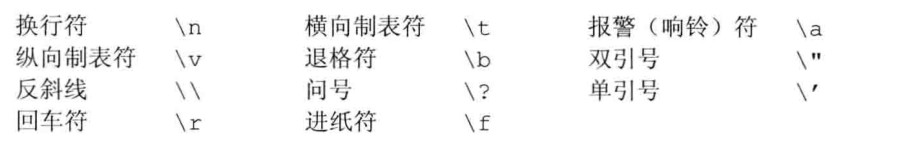
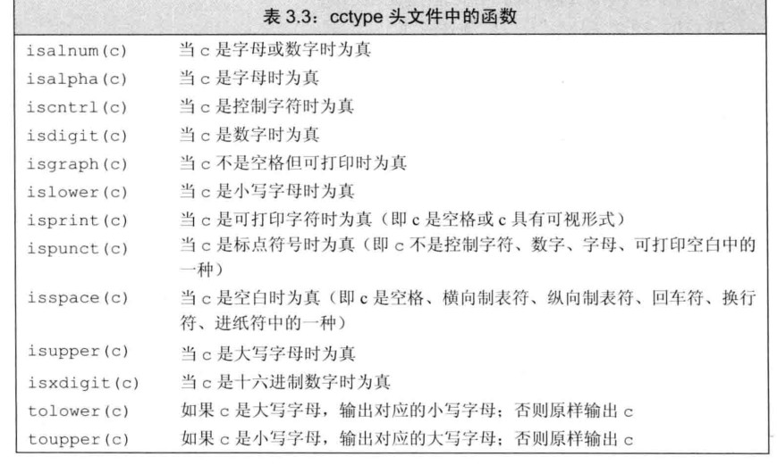

# cpp Primer Note

## 变量和基本类型

- ### 内置类型

- 数字类型
  - 数字类型
  
    - int and unsigned一起运算，int->unsigned int 类型转换 ，不能混用无符号有符号数。
    - 字面值
    
    - 转义字符
      
- 变量
  - 列表初始化

  ```c++
  int units_sold = 0;
  int units_sold = {0};
  int units_sold{0};
  int units_sold(0);
  long double ld = 3.1415926536;
  int a{ld}, b = {ld}; // error: narrowing conversion required
  int c(ld), d = ld; // ok: but value will be truncated
  ```

  - 初始化 函数内部的内置变量未初始化是未定义的
  - 声明和定义 只能声明一次

  ```c++
  extern int a;//声明
  extern int a = 1;//声明加定义
  int a;//定义
  ```

  - 第一次使用变量时再定义它
  - `::`可以访问全局作用域变量
  - 复合类型
    - 引用 必须初始化，是一个别名

    ```c++
    //类型必须匹配，并且只能绑定到对象上
    //初始化常量引用时，可以是任意表达式
    int a = 1;
    int &b = a;
    int &c = b;
    ```

    - 指针

    ```c++
    //允许指向常量的指针指向一个非常量对象
    //无法定义指向引用的指针，引用不是对象，没有地址
    /*

    */
    int a = 10;
    int *p = &a;
    //空指针
    int *p1 = nullptr; //最好使用这种用法
    int *p2 = 0;
    int *p3 = NULL;

    //void *指针, 可以存放任意的对象
    double pi = 3.14, *p = &pi;
    void *pv = &pi;
    pv = p;

    ```

    - 指向指针的引用
    复杂的声明语句，从右向左阅读辨别类型
    
    - const 关键字定义常量

     ```cpp
       //一般情况下只在本文件内有效
       //在文件间共享，都用extern声明
       const int i = get_size(); // ok: initialized at run time
       const int j = 42; // ok: initialized at compile time
       const int k; // error: k is uninitialized const
    ```

      - 常量引用
      
      ```cpp
         //可以定义常量的引用
         //指向常量的指针和引用，不能通过指针和引用修改对象的值
         //const修饰引用的时候不能改变它的值
         //const可以引用非常量，知识不允许修改他的值
         int i = 42;
         const int &r1 = i; // we can bind a const int& to a plain int object
         const int &r2 = 42; // ok: r1 is a reference to const
         const int &r3 = r1 * 2; // ok: r3 is a reference to const
         int &r4 = r * 2; // error: r4 is a plain, non const reference
      ```
      - 类型别名
      `using SI = Sales_item;`  //SI是一个别名
    - auto 自动推到类型，使用引用时，得到的是引用对象的类型。不能推导顶层的const
    - decltype 顶层的const
    
## 字符串，向量，数组
- ### using
    - `using std::cin`命名空间声明
    - 头文件中不要使用using
  
- ### string
    - 表示可变长字符序列，初始化方式,使用等号是拷贝初始化，否则是直接初始化
      
    - string的操作
      
    - string::size() 返回string::size_type类型
    - 连接字符串的加号必须保证至少有一个字符串
    - cctype
      
    - 范围for语句
      ```cpp
      string s("hello World!!!");
      //转换成大写形式
      for (auto &c : s)
      {
          c = toupper(c);
      }
      cout << s << endl;
      ```
- ### vector
    - 范围for循环不能添加元素，改变vector容量的操作使迭代器失效
    - 初始化
       
    - 相关的操作  
      
    - 范围for语句
      ```cpp
        vector<int> v{1,2,3,4,5,6,7,8,9};
        for (auto &i : v)
        {
            i *= i;
        }
        for (auto i : v)
        {
            cout << i << " ";
        }
        cout << endl;
      ```
    - 迭代器
      - 迭代器操作
      
      ```cpp
      //迭代器
      string s("some thing");
      for (auto it = s.begin(); it != s.end() && !isspace(*it); ++it)
      {
          *it = toupper(*it);
      }
  
      cout << s << endl;
      
      //迭代器类型
      vector<int>::iterator it; // it can read and write vector<int> elements
      string::iterator it2; // it2 can read and write characters in a string
      vector<int>::const_iterator it3; // it3 can read but not write elements
      string::const_iterator it4; // it4 can read but not write characters
      //常量类迭代器
      auto it3 = v.cbegin(); 
      
      ```
      - 迭代器的距离，`s.bigin()-s.end()` 类型是`difference_type `
      
- ### 数组
    - 范围for循环,或者下标访问,迭代器，指针
    - auto 指针 decltype 数组，指针可以用作迭代器
    -  库函数
    ```cpp
      int arr[] = {0,1,2,3,4,-1,5,6,7,8,9};
      
      int *start = begin(arr);
      int *stop = end(arr);
      while (start < stop && *start >= 0)
      {
          start++;
      }
      cout << *start << endl;
    ```
    - 两个指针相减的结果为：ptrdiff_t类型
    - 多维数组for循环，除去最后一层循环外都要用引用。也可以使用auto，和迭代器
    - ```cpp
      int *p[4] //整型指针数组
      int (*p)[4] //指向4个整数的数组
     
      ```
## 表达式

- 右值用的对象值（内容），左值用的对象的身份，内存中的位置


## 语句
- 范围for语句，容器，数组，字符串
- do-while至少会执行一次语句
- try catch throw
  ```cpp
  
  if(item1.isbn() !+ item2.isbn())
  {
      throw runtime_error("Data must refer to same ISBN");
  }
  
  
  try {
    program-statements
  }
  catch ()
  {
    handler-statements
  }
  catch ()
  {
    handler-statements
  }
  
  ```
  
  
## 函数

- 局部静态对象第一次初始化之后会一直存在，直到程序结束才消失
- 如果函数无需改变引用形参的值，使用常量引用 `void print(const int a)`
    - 使用引用避免拷贝，在函数中我们不希望改变内容，所以为常量。
    - 传到函数外部的变量，用引用，值会改变，所以是普通引用。
    - 只需要 c 的值，这个实参可能是右值(右值实参无法用于引用形参)，所以 c 不能用引用类型。
- 数组参数
  - c风格标记结束
  - 标准库传递首尾指针`void print(*begin, *end)`
  - 数组指针和数组大小`void print(const int *a, size_t n)`
  - 传递数组引用 `void print(int (&a)[10])`
  - 二维数组`void print(int (*mat)[10], int row)`
     `void print(int mat[][10], int row)`
     
- 可变形参
  - initializer_list形参
    
    ```cpp
    int sumInt(initializer_list<int> s)
    {
        int sum = 0;
        for (const auto &c : s)
        {
            sum += c;
        }
        return sum;
    }

    ```
- 返回值
    - 不能返回局部变量的引用和指针
    - 引用返回左值，可以进行赋值`get_val(s, 0) = 'A'`
    - 可以用列表初始化返回值  `return {"function","ok!"}`
    - 返回数组指针   `int (*func(int i))[10];`
    - 尾置返回类型 `auto func(int i) -> int(*)[10];`
    
- 特殊特性
    - 默认实参，一旦某个形参被赋予了默认值，后面的所有形参都必须是默认值
    
## 类
- 访问控制


